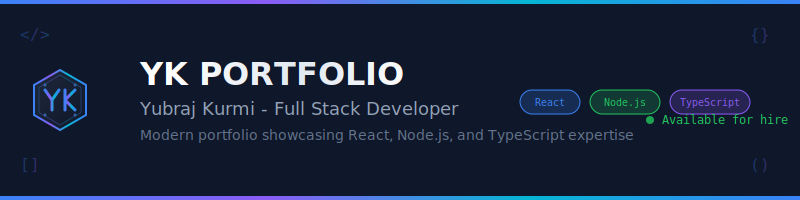

<div align="center">
  
</div>

# YK Portfolio - Yubraj Kurmi

A modern, professional portfolio website showcasing full-stack development expertise. Built with React, TypeScript, and Express.js featuring clean design, responsive interface, and comprehensive project showcase.

## 🌟 Live Features

✨ **Professional Portfolio Website** - Complete showcase of development expertise
🎯 **Terminal-Style Interface** - Interactive contact form with command-line aesthetics  
📱 **100% Responsive Design** - Perfect experience on all devices
💼 **Complete Resume Preview** - Full professional resume displayed in-browser
🔄 **Advanced Loading Animation** - Sci-fi themed preloader matching app design
🎨 **Landing Intro Page** - Animated welcome experience with feature highlights
⚡ **Zero External Dependencies** - Completely self-contained application

## 📋 Table of Contents

- [Features Overview](#features-overview)
- [Technology Stack](#technology-stack)
- [Getting Started](#getting-started)
- [Project Structure](#project-structure)
- [User Guide](#user-guide)
- [Developer Guide](#developer-guide)
- [API Documentation](#api-documentation)
- [Deployment](#deployment)
- [Contact](#contact)

## ✨ Features Overview

### 🎯 Core Portfolio Features

**🏠 Landing Intro Page** (`/landing`)
- Animated particle background with floating elements
- Typewriter effect introduction
- Interactive feature cards highlighting expertise
- Smooth navigation to main portfolio

**🖥️ Home Page** (`/`)
- Terminal-style typewriter animation (optimized speed: 150ms)
- Professional logo with illustrated YK monogram design
- Floating animation effects with hover interactions
- Modern glassmorphism design elements

**👨‍💻 About Section** (`/about`)
- Skills radar chart showing technical proficiency
- Achievement badges with animated reveals
- Professional background and expertise summary
- Interactive skill categories and experience metrics

**💼 Projects Showcase** (`/projects`)
- Detailed project case studies with live demos
- Technology stack visualization for each project
- GitHub repository links and code examples
- Enterprise-level project metrics and outcomes

**📈 Experience Timeline** (`/experience`)
- Professional career progression with visual timeline
- Technology highlights for each role
- Quantified achievements and business impact
- Leadership and mentoring experience showcase

**📞 Contact & Communication** (`/contact`)
- **NEW**: Redesigned terminal-style contact form
- Interactive project type selection and budget estimation
- Real-time availability indicator
- Professional contact information cards
- Integrated pricing calculator with Nepali Rupee (NPR) conversion

**📄 Resume & Skills** (`/resume`)
- **NEW**: Complete resume preview (not partial)
- Comprehensive professional summary
- Detailed experience sections with achievements
- Education and certification listings
- Skills breakdown with proficiency levels
- Direct PDF download functionality

### 🎨 Technical Excellence

**🎯 Advanced Loading System**
- **NEW**: Redesigned loading animation matching app theme
- Quantum processing themed messages
- Progress bar with percentage tracking
- Animated logo with gradient effects
- Professional status updates

**🎨 Visual Design System**
- Illustrated logo design with hexagonal shapes and tech elements
- Professional gradient color schemes (neon green, cyber blue, purple)
- Glassmorphism effects with backdrop blur
- Terminal window styling for forms
- Floating animations and hover effects

**📱 Responsive Excellence**
- Mobile-first design approach
- Optimized breakpoints for all screen sizes
- Touch-friendly interaction elements
- Fast loading with optimized assets
- System fonts for maximum performance

## 🛠️ Technology Stack

### Frontend Architecture
- **React 18.2+** - Modern React with concurrent features
- **TypeScript 5.0+** - Strict type checking and IntelliSense
- **Tailwind CSS 3.4+** - Utility-first styling with custom design system
- **Framer Motion 11+** - Physics-based animations and gestures
- **Wouter 3.0+** - Lightweight client-side routing (2.8kb)
- **TanStack Query 5+** - Powerful server state management
- **Radix UI** - Accessible component primitives

### Backend Infrastructure
- **Express.js 4.19+** - Fast, minimal Node.js web framework
- **TypeScript** - Full server-side type safety
- **PostgreSQL 16+** - Production-grade relational database
- **Drizzle ORM** - Type-safe database queries
- **Express Validator** - Request validation and sanitization
- **Helmet.js** - Security headers and protection
- **Rate Limiting** - API protection against abuse

### Development Tools
- **Vite 5.0+** - Lightning-fast build tool with HMR
- **ESBuild** - Extremely fast production bundler
- **TSX** - TypeScript execution for development
- **PostCSS** - CSS processing with autoprefixer

## 🚀 Getting Started

### Prerequisites
- **Node.js**: Version 18.0+ (LTS recommended)
- **PostgreSQL**: Version 14+ (optional with Replit)
- **Git**: Latest version for version control

### Quick Start with Replit (Recommended)

1. **Fork the Project**
   ```
   Visit the Replit project → Click "Fork"
   All dependencies installed automatically
   ```

2. **Launch Application**
   ```bash
   npm run dev
   ```

3. **Access Your Portfolio**
   ```
   Application starts automatically at provided URL
   Ready for customization immediately
   ```

### Local Development Setup

1. **Clone Repository**
   ```bash
   git clone https://github.com/YourUsername/yubraj-portfolio.git
   cd yubraj-portfolio
   ```

2. **Install Dependencies**
   ```bash
   npm install
   ```

3. **Environment Setup**
   ```bash
   cp .env.example .env
   # Edit .env with your database configuration
   ```

4. **Database Migration**
   ```bash
   npm run db:generate
   npm run db:push
   ```

5. **Start Development Server**
   ```bash
   npm run dev
   # Available at http://localhost:5000
   ```

## 📁 Project Structure

```
📦 Portfolio Architecture
├── 🎨 Frontend (React SPA)
│   ├── 📄 pages/
│   │   ├── landing.tsx        # NEW: Animated intro page
│   │   ├── home.tsx          # Terminal-style homepage
│   │   ├── about.tsx         # Skills and background
│   │   ├── projects.tsx      # Project showcase
│   │   ├── experience.tsx    # Career timeline
│   │   ├── contact.tsx       # NEW: Terminal contact form
│   │   └── resume.tsx        # NEW: Complete resume preview
│   ├── 🧩 components/
│   │   ├── ui/
│   │   │   ├── logo.tsx          # NEW: Illustrated logo design
│   │   │   ├── preloader.tsx     # NEW: Advanced loading animation
│   │   │   ├── terminal-window.tsx
│   │   │   ├── pricing-calculator.tsx
│   │   │   └── skills-radar.tsx
│   │   └── layout/
│   │       ├── navbar.tsx
│   │       └── footer.tsx
│   ├── 🎣 hooks/
│   │   ├── use-typewriter.tsx    # Optimized typing animation
│   │   └── use-toast.ts
│   └── 🎨 styles/
│       └── index.css             # NEW: Terminal and glassmorphism styles
├── ⚙️ Backend (Express API)
│   ├── routes.ts               # Contact form and API endpoints
│   ├── storage.ts             # Database interface
│   └── index.ts               # Server configuration
├── 🗄️ Database (PostgreSQL)
│   └── schema.ts              # Drizzle ORM definitions
└── 📁 Static Assets
    ├── resume.pdf             # Professional resume
    └── public/                # Optimized images and icons
```

## 👥 User Guide

### 🧭 Navigation Overview

**Main Pages:**
1. **Landing** (`/landing`) - Animated introduction with feature overview
2. **Home** (`/`) - Terminal-style introduction and professional summary
3. **About** (`/about`) - Skills visualization and background
4. **Projects** (`/projects`) - Portfolio showcase with case studies
5. **Experience** (`/experience`) - Career timeline and achievements
6. **Contact** (`/contact`) - Terminal contact form and pricing calculator
7. **Resume** (`/resume`) - Complete resume preview and download

### 💰 Getting Project Quotes

**Using the Pricing Calculator:**

1. **Navigate to Contact Page**
   - Professional terminal-style interface
   - Multiple contact methods available

2. **Select Project Type**
   - Web Application: Starting NPR 332,500
   - Mobile App: Starting NPR 465,500
   - E-commerce Platform: Starting NPR 598,500
   - API Development: Starting NPR 266,000

3. **Customize Requirements**
   - Adjust timeline (2-12 weeks)
   - Add features and integrations
   - See real-time cost updates

4. **Submit Quote Request**
   - Automatic email generation
   - Direct contact information provided
   - 24-hour response guarantee

### 📱 Mobile Experience

**Optimized Features:**
- Touch-friendly terminal interface
- Responsive pricing calculator
- Mobile-optimized resume viewer
- Fast loading with system fonts
- Thumb-friendly navigation

## 👨‍💻 Developer Guide

### 🔧 Development Workflow

1. **Make Changes**
   ```bash
   # Edit files in client/src/ or server/
   # Hot reload automatically updates browser
   ```

2. **Test Features**
   ```bash
   # Contact form testing
   curl -X POST http://localhost:5000/api/contact \
   -H "Content-Type: application/json" \
   -d '{"name":"Test","email":"test@example.com","message":"Hello"}'
   ```

3. **Check Types**
   ```bash
   npm run type-check
   ```

4. **Build Production**
   ```bash
   npm run build
   ```

### 🎨 Customization Guide

**Logo Customization:**
```tsx
// Edit client/src/components/ui/logo.tsx
// Modify SVG gradients, shapes, and animations
// Update colors and effects to match your brand
```

**Contact Form Styling:**
```css
/* Edit client/src/index.css */
/* Terminal styling section */
.terminal-window { /* Your customizations */ }
.terminal-input { /* Form input styles */ }
```

**Animation Timing:**
```tsx
// client/src/hooks/use-typewriter.tsx
// Adjust typing speed (currently 150ms)
export function useTypewriter(text: string, speed: number = 150)
```

### 🗄️ Database Schema

```sql
-- Core user table for contact management
CREATE TABLE users (
  id SERIAL PRIMARY KEY,
  username VARCHAR(255) UNIQUE NOT NULL,
  created_at TIMESTAMP DEFAULT NOW()
);

-- Contact form submissions
CREATE TABLE contacts (
  id SERIAL PRIMARY KEY,
  name VARCHAR(255) NOT NULL,
  email VARCHAR(255) NOT NULL,
  subject VARCHAR(255),
  message TEXT NOT NULL,
  project_type VARCHAR(100),
  budget VARCHAR(100),
  created_at TIMESTAMP DEFAULT NOW()
);
```

## 🌐 API Documentation

### 📞 Contact Endpoints

**Submit Contact Form**
```http
POST /api/contact
Content-Type: application/json

{
  "name": "Client Name",
  "email": "client@example.com", 
  "subject": "Project Inquiry",
  "message": "Project description",
  "projectType": "web-development",
  "budget": "50000-100000"
}
```

**Response:**
```json
{
  "success": true,
  "message": "Contact form submitted successfully",
  "id": "contact_123"
}
```

**Health Check**
```http
GET /api/health

Response:
{
  "status": "healthy",
  "timestamp": "2025-06-29T10:30:00.000Z",
  "uptime": "2h 15m 30s"
}
```

### 🔒 Security Features

- **Rate Limiting**: 10 requests per minute per IP
- **Input Validation**: Comprehensive sanitization
- **CORS Protection**: Configured for production domains
- **SQL Injection Prevention**: Drizzle ORM parameterized queries
- **XSS Protection**: Content Security Policy headers

## 🚀 Deployment

### 🔧 Replit Deployment (Recommended)

1. **Automatic Deployment**
   ```
   Push to main branch → Auto-deploy to Replit
   Custom domain configuration available
   SSL/TLS certificates managed automatically
   ```

2. **Environment Variables**
   ```
   DATABASE_URL - Automatically configured
   NODE_ENV - Set to production
   PORT - Auto-assigned by Replit
   ```

### 🌍 Alternative Deployment Options

**Vercel (Frontend + Serverless Functions):**
```bash
npm install -g vercel
vercel deploy
```

**Railway (Full Stack):**
```bash
railway login
railway deploy
```

**DigitalOcean App Platform:**
```bash
# Connect GitHub repository
# Auto-deploy with database addon
```

### 📊 Performance Optimization

**Frontend Optimization:**
- Code splitting with Vite
- Lazy loading for components
- Optimized image formats
- System fonts (no external dependencies)

**Backend Optimization:**
- Express.js performance middleware
- PostgreSQL connection pooling
- Compression for static assets
- Caching strategies for API responses

## 📞 Contact & Support

### 👨‍💻 Developer Contact

**Yubraj Kurmi**
- **Email**: developerrajir@gmail.com
- **LinkedIn**: [yuvrajkurmi03](https://linkedin.com/in/yuvrajkurmi03)
- **GitHub**: [DevMaestroHQ](https://github.com/DevMaestroHQ)
- **Phone**: +977-98XXXXXXXX

**Professional Services:**
- Portfolio customization and branding
- Additional feature development
- Technical consultation and code review
- Deployment assistance and hosting setup

### 🛠️ Technical Support

**Response Times:**
- **Critical Issues**: Within 4 hours
- **General Questions**: Within 24 hours  
- **Feature Requests**: Within 48 hours

**Support Channels:**
- GitHub Issues for bug reports
- Email for project inquiries
- LinkedIn for professional networking

### 💼 Hire for Your Project

**Available Services:**
- **Custom Portfolio Development**: Complete personal/business portfolio websites
- **Full-Stack Web Applications**: E-commerce, SaaS, business management systems
- **Mobile App Development**: React Native cross-platform applications
- **API Development**: RESTful APIs and microservices architecture
- **Technical Consultation**: Code review, architecture planning, technology selection

**Project Process:**
1. **Discovery Call**: Understand requirements and goals
2. **Proposal & Quote**: Detailed timeline and cost estimate
3. **Development Phases**: Iterative development with regular updates
4. **Testing & Launch**: Comprehensive testing and deployment
5. **Ongoing Support**: Maintenance and feature updates

---

## 📄 License

This project is licensed under the MIT License - see the [LICENSE](LICENSE) file for details.

**Commercial Use:** Feel free to use this portfolio template for your own projects. Attribution appreciated but not required.

---

**⭐ Star this repository if you found it helpful!**

**🔄 Fork and customize for your own portfolio**

**🚀 Deploy your version and share it with the community**

---

*Last Updated: June 29, 2025*
*Version: 2.0.0 - Complete Portfolio Redesign*